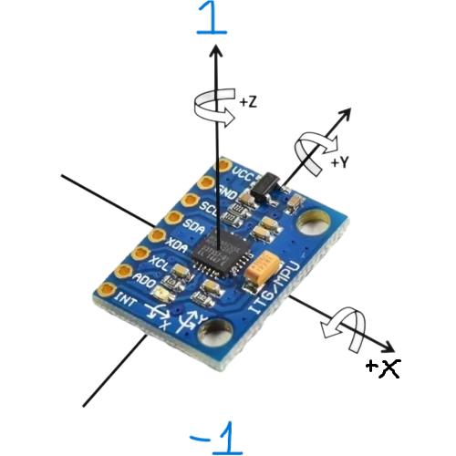

# GY87-MPU6050 Sensor Reading System

A comprehensive system for reading GY87-MPU6050 sensor data using STM32F103C8T6 microcontroller with advanced I2C scanning capabilities and Python streaming scripts for real-time visualization.

## 📋 Overview

The **GY-87 10DOF (10 Degrees of Freedom)** module is an integrated multi-sensor breakout board that combines four essential sensors:

- **MPU6050**: 6-axis IMU (3-axis accelerometer + 3-axis gyroscope)
- **HMC5883L**: 3-axis digital compass/magnetometer
- **BMP180**: Barometric pressure sensor with temperature compensation
- **Integrated Design**: All sensors communicate via I2C on a single compact PCB

### Communication Protocol Specification

**Jetson ↔ STM32 Data Frame Format:**

```
┌─────────┬──────────────┬─────────────┬─────────┐
│ START   │ DATA PAYLOAD │ CHECKSUM    │ END     │
│ 1 byte  │ 36 bytes     │ 2 bytes     │ 1 byte  │
└─────────┴──────────────┴─────────────┴─────────┘
Total Frame Size: 40 bytes
```

### Data Payload Structure (36 bytes)

| Sensor Type       | Data Format    | Size per Axis | Total Size | Unit  |
| ----------------- | -------------- | ------------- | ---------- | ----- |
| **Accelerometer** | IEEE 754 Float | 4 bytes       | 12 bytes   | m/s²  |
| **Gyroscope**     | IEEE 754 Float | 4 bytes       | 12 bytes   | rad/s |
| **Magnetometer**  | IEEE 754 Float | 4 bytes       | 12 bytes   | Tesla |

**Data Layout:**

```c
struct SensorData {
    float accel_x, accel_y, accel_z;    // 12 bytes (m/s²)
    float gyro_x, gyro_y, gyro_z;       // 12 bytes (rad/s)
    float mag_x, mag_y, mag_z;          // 12 bytes (Tesla)
    // Total: 36 bytes
};
```

### Performance Requirements

| Parameter         | Specification           | Implementation       |
| ----------------- | ----------------------- | -------------------- |
| **Sample Rate**   | 100 Hz                  | 10 ms period         |
| **Data Latency**  | < 5 ms                  | Real-time processing |
| **Communication** | UART 921600 baud        | STM32 ↔ Host         |
| **I2C Speed**     | 100 kHz (Standard Mode) | Sensor communication |

## 🛠️ Hardware

### STM32F103C8T6 (Blue Pill)

- **MCU**: ARM Cortex-M3, 72MHz
- **Flash**: 64KB
- **RAM**: 20KB
- **I2C**: PB6 (SCL), PB7 (SDA) - MPU6050 connection
- **UART**: PA2 (TX), PA3 (RX) - PC communication

### GY87-MPU6050 Module Specifications

#### MPU6050 (6-Axis IMU)

| Parameter               | Specification      | Details                               |
| ----------------------- | ------------------ | ------------------------------------- |
| **Accelerometer**       | 3-axis, 16-bit ADC | ±2g/±4g/±8g/±16g (selectable)         |
| **Gyroscope**           | 3-axis, 16-bit ADC | ±250/±500/±1000/±2000°/s (selectable) |
| **Temperature**         | Built-in sensor    | -40°C to +85°C                        |
| **I2C Address**         | 7-bit addressing   | 0x68 (AD0=GND), 0x69 (AD0=VCC)        |
| **Supply Voltage**      | Operating range    | 2.375V - 3.46V                        |
| **Current Consumption** | Normal operation   | 3.9mA (all sensors active)            |

#### HMC5883L (3-Axis Magnetometer)

| Parameter               | Specification        | Details                              |
| ----------------------- | -------------------- | ------------------------------------ |
| **Measurement Range**   | ±0.88 to ±8.1 Gauss (configurable) | Set by gain (default ±1.3 Ga)      |
| **Sensitivity**         | 1090 LSB/Ga @ 1.3 Ga | Used for raw-to-Gauss conversion    |
| **Sample Rate**         | 0.75–75 Hz           | Default 15 Hz                        |
| **I2C Address**         | 7-bit addressing     | 0x1E (fixed)                         |
| **Supply Voltage**      | Operating range      | 2.16V - 3.6V                         |
| **Current Consumption** | Normal operation     | 100μA (measuring), 2.5μA (idle)      |

#### BMP180 (Barometric Pressure Sensor)

| Parameter               | Specification       | Details                                  |
| ----------------------- | ------------------- | ---------------------------------------- |
| **Pressure Range**      | Measurement range   | 300 - 1100 hPa (9000m to -500m altitude) |
| **Accuracy**            | Absolute accuracy   | ±1 hPa (±8m altitude)                    |
| **Resolution**          | Pressure resolution | 0.01 hPa (0.08m altitude)                |
| **Temperature Range**   | Operating range     | -40°C to +85°C                           |
| **I2C Address**         | 7-bit addressing    | 0x77 (fixed)                             |
| **Supply Voltage**      | Operating range     | 1.8V - 3.6V                              |
| **Current Consumption** | Normal operation    | 5µA (1 sample/sec)                       |

#### Module Integration Features

- **Compact Design**: 25.4mm × 15.2mm PCB
- **Level Shifters**: 3.3V/5V compatible I/O
- **Pull-up Resistors**: Built-in 4.7kΩ on I2C lines
- **Pin Headers**: 0.1" (2.54mm) spacing for breadboard compatibility
- **Mounting Holes**: M2 screws for secure installation



### Connections

```
STM32F103C8T6    GY87-MPU6050
PB6 (SCL)    →   SCL
PB7 (SDA)    →   SDA
3.3V         →   VCC
GND          →   GND

STM32F103C8T6    USB-UART
PA2 (TX)     →   RX
PA3 (RX)     →   TX
GND          →   GND
3.3V         →   VCC (if needed)
```

### I2C Scanner Feature

The system now includes an automatic I2C scanner that:

- Scans addresses from 0x08 to 0x77
- Reports all detected devices with their addresses
- Helps debug I2C connection issues
- Runs automatically on startup

**Example Output:**

```
=== I2C Scanner Started ===
Scanning I2C bus for devices...
Device found at address: 0x68 (104)
Total devices found: 1
=== I2C Scanner Completed ===
```

## 🧮 Mathematical Calculations

### Raw Data Conversion

The MPU6050 provides raw 16-bit signed integer values that need to be converted to physical units.

#### Accelerometer Conversion

**Formula:**

```
Acceleration (m/s²) = (Raw_Value / 16384) × 9.81
```

**Where:**

- `Raw_Value`: 16-bit signed integer from sensor
- `16384`: LSB per g for ±2g range (2^15 / 2g = 16384)
- `9.81`: Conversion factor from g to m/s²

**Code Implementation:**

```c
float GY87_MPU6050_Get_Ax(void) {
    return (float)(((int16_t)(data_rx[0]<<8 | data_rx[1]))/(float)16384) * 9.81f;
}
```

#### Gyroscope Conversion

**Formula:**

```
Angular Velocity (rad/s) = (Raw_Value / 131) × (π / 180)
```

**Where:**

- `Raw_Value`: 16-bit signed integer from sensor
- `131`: LSB per °/s for ±250°/s range (2^15 / 250 = 131)
- `π/180`: Conversion factor from degrees to radians

**Code Implementation:**

```c
float GY87_MPU6050_Get_Gx(void) {
    return (float)(((int16_t)(data_rx[10]<<8 | data_rx[11]))/(float)131) * (M_PI / 180.0f);
}
```

#### Temperature Conversion

**Formula:**

```
Temperature (°C) = (Raw_Value / 340) + 36.53
```

**Where:**

- `Raw_Value`: 16-bit signed integer from sensor
- `340`: LSB per °C (from datasheet)
- `36.53`: Offset temperature (°C)

**Code Implementation:**

```c
float GY87_MPU6050_Get_Temperature(void) {
    return (float)(((int16_t)(data_rx[6]<<8 | data_rx[7]))/(float)340 + (float)36.53);
}
```

### Angle Calculations

#### Roll and Pitch from Accelerometer

**Formulas:**

```
Roll = atan2(Ay, √(Ax² + Az²)) × (180/π)
Pitch = atan2(-Ax, √(Ay² + Az²)) × (180/π)
```

**Where:**

- `Ax, Ay, Az`: Accelerometer values in m/s²
- `atan2`: Four-quadrant arctangent function
- `180/π`: Conversion from radians to degrees

**Code Implementation:**

```c
void GY87_MPU6050_CalculateAngles(float* roll, float* pitch, float* yaw) {
    float ax = GY87_MPU6050_Get_Ax();
    float ay = GY87_MPU6050_Get_Ay();
    float az = GY87_MPU6050_Get_Az();

    *roll = atan2(ay, sqrt(ax*ax + az*az)) * 180.0f / M_PI;
    *pitch = atan2(-ax, sqrt(ay*ay + az*az)) * 180.0f / M_PI;
    *yaw = 0.0f; // Cannot be calculated from accelerometer alone
}
```

#### Complementary Filter

**Formula:**

```
Angle = α × (Previous_Angle + Gyro_Rate × dt) + (1-α) × Acc_Angle
```

**Where:**

- `α`: Filter coefficient (0.98 for gyro, 0.02 for acc)
- `Previous_Angle`: Previous calculated angle
- `Gyro_Rate`: Gyroscope reading in rad/s
- `dt`: Time step in seconds
- `Acc_Angle`: Angle calculated from accelerometer

**Code Implementation:**

```c
void GY87_MPU6050_ComplementaryFilter(float* roll, float* pitch, float* yaw, float dt) {
    float ax = GY87_MPU6050_Get_Ax();
    float ay = GY87_MPU6050_Get_Ay();
    float az = GY87_MPU6050_Get_Az();
    float gx = GY87_MPU6050_Get_Gx(); // rad/s
    float gy = GY87_MPU6050_Get_Gy(); // rad/s
    float gz = GY87_MPU6050_Get_Gz(); // rad/s

    // Calculate angles from accelerometer
    float acc_roll = atan2(ay, sqrt(ax*ax + az*az)) * 180.0f / M_PI;
    float acc_pitch = atan2(-ax, sqrt(ay*ay + az*az)) * 180.0f / M_PI;

    // Complementary filter
    float alpha = 0.98f;
    *roll = alpha * (prev_roll + gx * dt * 180.0f / M_PI) + (1.0f - alpha) * acc_roll;
    *pitch = alpha * (prev_pitch + gy * dt * 180.0f / M_PI) + (1.0f - alpha) * acc_pitch;
    *yaw = prev_yaw + gz * dt * 180.0f / M_PI; // Yaw from gyro only

    // Update previous values
    prev_roll = *roll;
    prev_pitch = *pitch;
    prev_yaw = *yaw;
}
```

### Sensor Specifications and Ranges

#### Accelerometer Ranges

| Range | LSB/g | Resolution | Max Value    |
| ----- | ----- | ---------- | ------------ |
| ±2g   | 16384 | 0.061 mg   | ±19.62 m/s²  |
| ±4g   | 8192  | 0.122 mg   | ±39.24 m/s²  |
| ±8g   | 4096  | 0.244 mg   | ±78.48 m/s²  |
| ±16g  | 2048  | 0.488 mg   | ±156.96 m/s² |

#### Gyroscope Ranges

| Range    | LSB/(°/s) | Resolution | Max Value    |
| -------- | --------- | ---------- | ------------ |
| ±250°/s  | 131       | 0.0076°/s  | ±4.36 rad/s  |
| ±500°/s  | 65.5      | 0.015°/s   | ±8.73 rad/s  |
| ±1000°/s | 32.8      | 0.031°/s   | ±17.45 rad/s |
| ±2000°/s | 16.4      | 0.061°/s   | ±34.91 rad/s |

### Error Analysis

#### Accelerometer Error Sources

1. **Noise**: ±0.1 mg RMS (typical)
2. **Offset**: ±60 mg (typical)
3. **Scale Factor**: ±2% (typical)
4. **Temperature Drift**: ±0.02%/°C

#### Gyroscope Error Sources

1. **Noise**: ±0.005°/s RMS (typical)
2. **Offset**: ±20°/s (typical)
3. **Scale Factor**: ±2% (typical)
4. **Temperature Drift**: ±0.02%/°C

#### Angle Calculation Errors

1. **Accelerometer Tilt**: ±1° (static conditions)
2. **Gyroscope Drift**: ±0.1°/s (without calibration)
3. **Complementary Filter**: Depends on α value and sampling rate

### Calibration Formulas

#### Accelerometer Calibration

```
Calibrated_Value = (Raw_Value - Offset) × Scale_Factor
```

#### Gyroscope Calibration

```
Calibrated_Value = (Raw_Value - Offset) × Scale_Factor
```

#### Offset Calculation (Static Calibration)

```
Offset = (Sum of 1000 samples) / 1000
```

#### Scale Factor Calculation

```
Scale_Factor = Known_Value / (Measured_Value - Offset)
```

## 🔧 GY87_MPU6050 Library Features

### Enhanced Library Functions

The new GY87_MPU6050 library provides all the original functionality plus advanced features:

#### I2C Scanner Functions

```c
// Scan all I2C devices on the bus
void GY87_I2C_Scanner(void);

// Check if specific device is ready
uint8_t GY87_I2C_IsDeviceReady(uint8_t address);
```

#### Core Sensor Functions

```c
// Initialization
void GY87_MPU6050_Init(void);

// Data reading
uint8_t GY87_MPU6050_Read_Data(void);

// Accelerometer (m/s²)
float GY87_MPU6050_Get_Ax(void);
float GY87_MPU6050_Get_Ay(void);
float GY87_MPU6050_Get_Az(void);

// Gyroscope (rad/s)
float GY87_MPU6050_Get_Gx(void);
float GY87_MPU6050_Get_Gy(void);
float GY87_MPU6050_Get_Gz(void);

// Temperature (°C)
float GY87_MPU6050_Get_Temperature(void);

// Angle calculations
void GY87_MPU6050_CalculateAngles(float* roll, float* pitch, float* yaw);
void GY87_MPU6050_ComplementaryFilter(float* roll, float* pitch, float* yaw, float dt);
```

### I2C Scanner Configuration

The I2C scanner can be configured using these definitions:

```c
#define I2C_SCAN_START_ADDR 0x08  // Starting address (default: 0x08)
#define I2C_SCAN_END_ADDR   0x77  // Ending address (default: 0x77)
#define I2C_SCAN_TIMEOUT    100   // Timeout in ms (default: 100)
```

### Usage Example

```c
#include "gy87_mpu6050.h"

int main(void) {
    // Initialize HAL and peripherals
    HAL_Init();
    SystemClock_Config();
    MX_GPIO_Init();
    MX_I2C1_Init();
    MX_USART2_UART_Init();

    // Scan I2C bus for devices
    GY87_I2C_Scanner();

    // Initialize MPU6050
    GY87_MPU6050_Init();
    HAL_Delay(300);

    UART_Printf("GY87 MPU6050 Initialized Successfully!\r\n");
    UART_Printf("Baud Rate: %lu\r\n", huart2.Init.BaudRate);

    while(1) {
        if(GY87_MPU6050_Read_Data()) {
            float ax = GY87_MPU6050_Get_Ax();
            float ay = GY87_MPU6050_Get_Ay();
            float az = GY87_MPU6050_Get_Az();

            // Process sensor data...
        }
        HAL_Delay(10);
    }
}
```

## 🚀 Installation

### 1. Environment Setup

**Requirements:**

- STM32CubeIDE or Keil uVision
- Python 3.7+
- USB-UART converter (CP2102, CH340, etc.)
- Breadboard and jumper wires

**Install Python dependencies:**

```bash
pip install -r requirements.txt
```

### 2. Flash STM32 Firmware

1. Open project in STM32CubeIDE
2. Build project (Ctrl+B)
3. Flash to STM32F103C8T6
4. Connect UART to computer (baud rate: 115200)

### 3. Test Connection

Run simple script to test:

```bash
python mpu6050_simple.py
```

## 📈 Data Display

### Accelerometer

- **Unit**: m/s² (meters per second squared)
- **Range**: ±19.62, ±39.24, ±78.48, ±156.96 m/s² (corresponding to ±2g, ±4g, ±8g, ±16g)
- **Resolution**: 160,727 LSB/(m/s²) (±2g range)

### Gyroscope

- **Unit**: rad/s (radians per second)
- **Range**: ±4.36, ±8.73, ±17.45, ±34.91 rad/s (corresponding to ±250, ±500, ±1000, ±2000 deg/s)
- **Resolution**: 2.29 LSB/(rad/s) (±250 deg/s range)

### Temperature

- **Unit**: °C
- **Range**: -40°C to +85°C
- **Resolution**: 340 LSB/°C

### Euler Angles

- **Roll**: Rotation around X-axis
- **Pitch**: Rotation around Y-axis
- **Yaw**: Rotation around Z-axis
- **Unit**: degrees

## 📁 Project Structure

```
MPU6050_Read/
├── Core/                          # STM32 Firmware
│   ├── Inc/                       # Header files
│   │   ├── gy87_mpu6050.h        # 🆕 GY87 MPU6050 driver with I2C scanner
│   │   ├── i2c.h                 # I2C configuration
│   │   ├── usart.h               # UART configuration
│   │   └── main.h                # Main header
│   └── Src/                       # Source files
│       ├── main.c                # Main application with I2C scanning
│       ├── gy87_mpu6050.c        # 🆕 Enhanced MPU6050 implementation
│       ├── i2c.c                 # I2C implementation
│       └── usart.c               # UART implementation
├── Drivers/                       # STM32 HAL drivers
├── Debug/                         # Build output
├── asset/                         # Documentation assets
│   └── MPU6050_Triple_Axis_Sensor_Module.png
├── requirements.txt              # Python dependencies
├── README.md                     # This file
```

## 🛠️ Troubleshooting

### Common Issues

#### 1. No I2C Devices Found

**Symptoms:**

```
=== I2C Scanner Started ===
Scanning I2C bus for devices...
No I2C devices found!
=== I2C Scanner Completed ===
```

**Solutions:**

- Check wiring connections (PB6→SCL, PB7→SDA)
- Verify power supply (3.3V to MPU6050)
- Check pull-up resistors on I2C lines (usually internal)
- Ensure I2C is properly configured in STM32CubeMX

#### 2. Wrong I2C Address

**Symptoms:**

- Scanner finds device at different address than expected

**Solutions:**

- Update `MPU6050_ADDRESS` definition in `gy87_mpu6050.h`
- Check if AD0 pin is connected to GND (0x68) or VCC (0x69)

#### 3. UART Output Not Visible

**Symptoms:**

- No output in serial terminal

**Solutions:**

- Verify baud rate: 115200
- Check UART connections (PA2→RX, PA3→TX)
- Ensure UART is initialized before calling scanner

#### 4. Build Errors

**Symptoms:**

- Compilation errors about missing functions

**Solutions:**

- Update all function calls to use `GY87_` prefix
- Include `gy87_mpu6050.h` instead of `mpu6050.h`
- Clean and rebuild project

### I2C Scanner Output Examples

**Successful Detection:**

```
=== I2C Scanner Started ===
Scanning I2C bus for devices...
Device found at address: 0x68 (104)
Total devices found: 1
=== I2C Scanner Completed ===
```

**Multiple Devices (GY-87 with all sensors):**

```
=== I2C Scanner Started ===
Scanning I2C bus for devices...
Device found at address: 0x1E (30)    # HMC5883L Magnetometer
Device found at address: 0x68 (104)   # MPU6050
Device found at address: 0x77 (119)   # BMP180 Pressure Sensor
Total devices found: 3
=== I2C Scanner Completed ===
```

---

**Author**: Nhan Vo  
**Created**: 2025  
**Version**: (GY87_MPU6050 Library)  
**Last Updated**: January 2025
